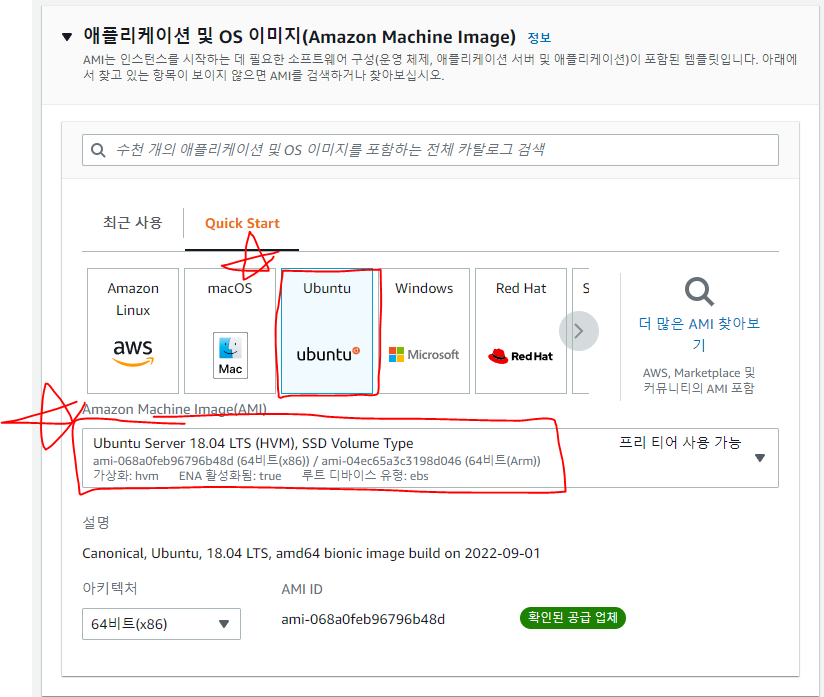
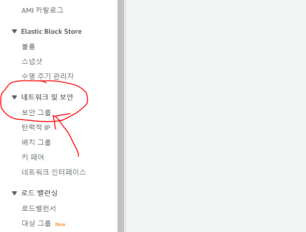
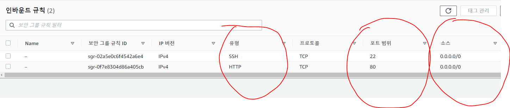

### 우분투는 리눅스라는 운영체제 종류 중 하나 🎅

### 자주 사용하는 리눅스 명령어

1. ls : 현재 경로 파일, 폴더 확인
2. pwd : 현재 위치 경로
3. mkdir : 디렉토리(폴더) 생성
4. rm : 파일, 폴더 삭제
5. mv : 파일, 폴더 이동
6. sudo : 관리자 권한으로 실행
7. vim : 파일 편집
8. clear : 명령어 지우기
9. netstat -tnlp : 실행 중인 포트 확인

### 우분투 시작하기 🕵️‍♀️

- 우분투 18.04 버전 선택 후 인스턴스 생성 클릭

### 웹서버 설치 step by step

1. sudo apt update (apt 업데이트 하기)
2. sudo apt install apache2 (웹서버 설치하기)
3. /var/www/html 경로에 html 파일이 있어야 함.
4. AWS 사이트에 들어가 보안그룹 클릭.

5. 인바운드, 아웃바운드 규칙 아래 사진과 같이 편집.

