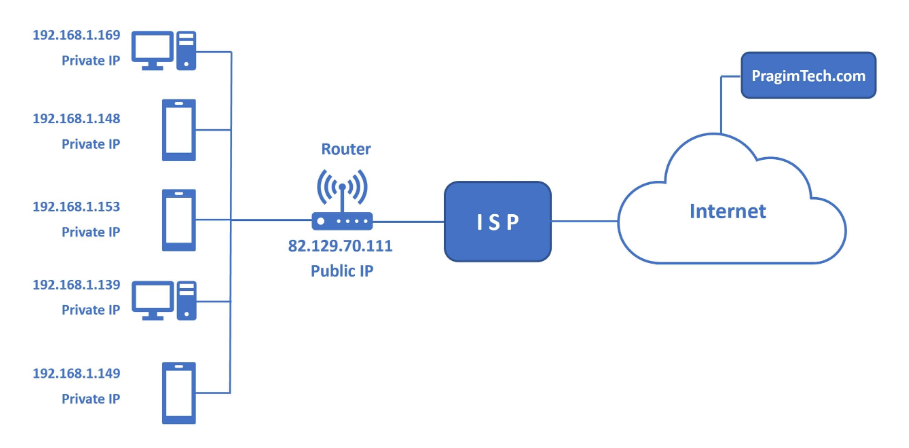

### 데이터베이스 서버란?
    서버란 서비스를 제공하는 컴퓨터를 의미.
    사용자는 서버에 접속해서 서비스를 이용할 수 있다!
    데이터베이스 서버는 데이터베이스라는 서비스를 제공하는 서버

### 다른 사람 데이터베이스 서버에 접속하기
    데이터베이스 서버에 접속하려면 아래 정보가 필요.
    - 서버 IP 
    - 포트번호
    - 데이터베이스 계정
    
    MYSQL 디폴트 포트번호는 3306
    오라클 디폴트 포트번호는 8080

    포트번호가 있어야 한 PC에 여러 서비스를 실행할 수 있다!🤩

### IP(Internet Protocol)
    IP(Internet Protocol)는 집주소와 같음.
    고유하지만 이사하면 주소가 바뀌듯 IP주소도 바뀔 수 있음.
    IP는 크게 2가지가 있음.

    Private IP (내부 IP)🔑 : 
    같은 내부에 있는 PC와 통신할 때 사용   
    외부에서 내부 IP로 접속할 수 없다.

    Public IP (외부 IP) 🐱‍🏍:
    외부에 있는 PC와 통신할 때 사용
    외부IP는 공유기(라우터)에서 확인할 수 있다.
    **공유기**(라우터)는 내부와 외부 통신을 감시하는 문지기!
 
 
### Public IP & Private IP 그림으로 보기

