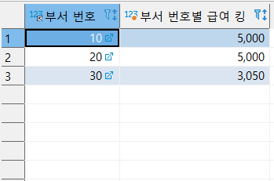

- 전체 컬럼 조회
- 직업이 MANAGER고 SALESMAN 사원들 이름, 직업, 급여 조회 단, 급여를 내림차순으로 정렬
- 보너스를 받은 사원 이름, 보너스 조회 단, 0은 제외입니다.
- 사원이름에 A가 들어간 모든 사원 번호, 이름, 직업 조회
- 부서번호별 최대급여, 최소급여, 인원수 조회
- 직책별 평균급여 조회
- 부서번호별 급여합계 조회 단, 10번 부서만
- 부서번호별 급여합계 조회 단, 급여합계가 5000 이상인 부서만
- 입사년도별 입사한 사원 수 조회
- 1983년 이후 입사한 사원의 보너스가 null 이면 급여의 10%를 보너스로 주고, 사원의 이름, 보너스, 급여 조회

#### 아래 결과를 보고 쿼리를 작성하시오.

