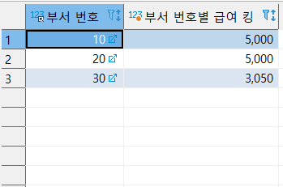

- 전체 컬럼 조회
```sql
	SELECT * FROM emp
```
- 직업이 MANAGER고 SALESMAN 사원들 이름, 직업, 급여 조회 단, 급여를 내림차순으로 정렬
```sql
	SELECT ename, job, sal FROM emp WHERE job = 'MANAGER' OR  job ='SALESMAN' ORDER BY sal DESC 
```
- 보너스를 받은 사원 이름, 보너스 조회 단, 0은 제외입니다.
```sql
	SELECT  ename, comm FROM emp WHERE comm is null AND comm != 0
```
- 사원이름에 A가 들어간 모든 사원 번호, 이름, 직업 조회
```sql
	SELECT empno, ename, job FROM emp WHERE ename LIKE "%A%"
```
- 부서번호별 최대급여, 최소급여, 인원수 조회
```sql
	SELECT deptno, max(sal), min(sal), count(*) FROM emp GROUP BY deptno
```
- 직책별 평균급여 조회
```sql
	SELECT job, avg(sal) FROM emp GROUP BY job
```
- 부서번호별 급여합계 조회 단, 10번 부서만
```sql
	SELECT deptno, sum(sal) FROM emp WHERE deptno = 10 GROUP BY deptno
```	
- 부서번호별 급여합계 조회 단, 급여합계가 5000 이상인 부서만
```sql
	SELECT deptno, sum(sal) FROM emp GROUP BY DEPTNO HAVING sum(sal) >= 5000
```	
- 입사년도별 입사한 사원 수 조회
```sql
	SELECT date_format(hiredate, "%Y"), count(*) FROM emp GROUP BY DATE_FORMAT(hiredate,'%Y')
```
- 1983년 이후 입사한 사원의 보너스가 null 이면 급여의 10%를 보너스로 주고, 사원의 이름, 보너스, 급여 조회
```sql
	SELECT ename, IFNULL(comm,sal * 0.1) AS '보너스', sal FROM emp WHERE DATE_FORMAT(hiredate,'%Y') >= '1983'
```
#### 아래 결과를 보고 쿼리를 작성하시오.



```sql
	SELECT deptno AS "부서번호", max(sal) AS "부서 번호별 급여 킹" FROM emp GROUP BY deptno ORDER BY max(sal) DESC
```