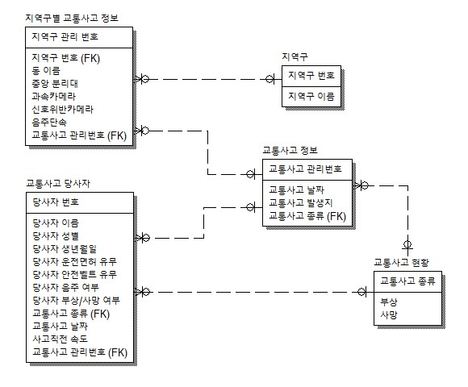

# DB_Modeling_Project - 대전 광역시 교통사고 분석 시스템

## 목차

1. 프로젝트 소개

2. 데이터

3. DB EDR modeling

4. 프로그래밍

5. 소감

## 프로젝트 소개

- 선택한 이유와 목표
    
    교통사고를 예방 및 방지하기 위한 단속이나 교통 정책 등 효율적으로 처리하기 위해 주제를 선정 했습니다.

    교통사고 자료를 수집하고 DB를 구축 및 분석하고 교통사고 분석 정보를 제공하여 단속, 교통안전 시설물, 교통안전 정책 등 교통사고를 사전에 예방 및 안전을 강화하는 것이 목표입니다.

- 시스템 소개

    교통사고가 발생한 지역의 단속카메라, 음주단속 등을 분석하여 사고지역에 필요한 부분을 파악할 수 있도록 했습니다.
    (음주운전, 과속, 중앙선 침범, 신호위반)

## 데이터

- 데이터는 Python을 통하여 교통사고 당사자들의 개인정보 1,000개와, 대전광역시 교통사고 686건의 가짜 데이터를 생성했습니다.

## DB ERD modeling

- 교통사고 현황, 교통사고 당사자, 교통사고 관리 정보, 지역구 정보, 지역구별 교통사고 정보
총 5개의 테이블로 구성했습니다.

 

## MySQL 프로그래밍

<a href="MySQL_programing/query.md">쿼리 보러가기</a> 

## 소감

    
    

        

