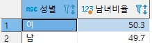
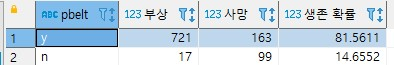
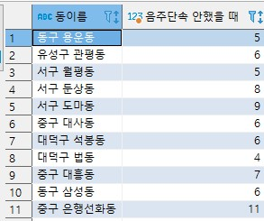
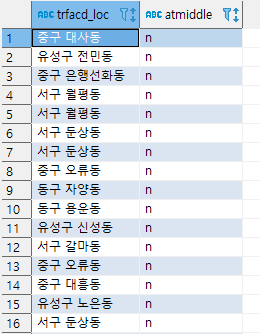
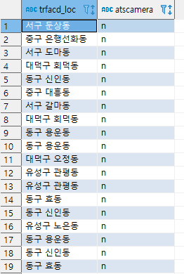
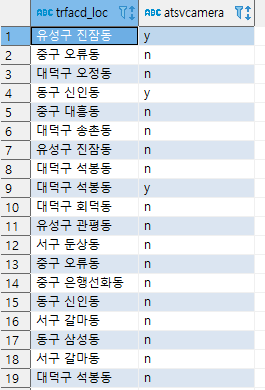
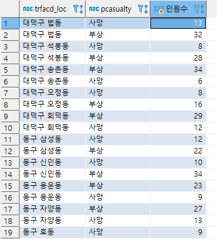
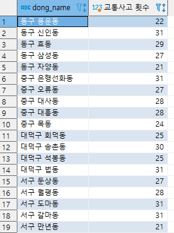
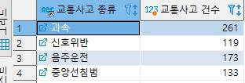

# MySQl Programing

- 기본적인 교통사고 비율과 교통사고 종류와 교통사고 단속의 상관관계를 분석 했습니다.


1. 전체 교통사고 부상/사망 비율
```sql
SELECT format(sum(injury)/sum(injury+dead)*100,1) AS '부상자 비율', 
format(sum(dead)/sum(injury+dead)*100,1) AS '사망자 비율' 
FROM trfacd_status
```


2. 각 교통사고 별 부상/사망 비율
```sql
SELECT trfacd_type, 
format(sum(injury)/sum(injury+dead)*100,1) AS '부상자 비율', 
format(sum(dead)/sum(injury+dead)*100,1) AS '사망자 비율'
FROM trfacd_status GROUP BY trfacd_type
```


3. 전체 교통사고 성비율
```sql
SELECT psex "성별" ,(count(psex) / (SELECT count(*) FROM trfacd_prt)*100) AS "남녀비율" FROM trfacd_prt
GROUP BY psex
```


4. 안전벨트 착용 유무에 따른 부상/사망과 생존확률
```sql
(SELECT pbelt, count(pcasualty) "부상", (SELECT count(pcasualty) "사망"
FROM trfacd_prt
WHERE pbelt = "y" AND pcasualty = '사망') AS "사망", count(pcasualty)/(count(pcasualty)+
(SELECT count(pcasualty) "사망"
FROM trfacd_prt
WHERE pbelt = "y" AND pcasualty = '사망')) * 100 AS "생존 확률"
FROM trfacd_prt
WHERE pbelt = "y" AND pcasualty = '부상'
GROUP BY pbelt)
UNION
(SELECT pbelt, count(pcasualty) "부상",
(
SELECT count(pcasualty)
FROM trfacd_prt
WHERE pbelt ="n" AND pcasualty = "사망"
) AS "사망",
count(pcasualty)/(count(pcasualty) + (
SELECT count(pcasualty)
FROM trfacd_prt
WHERE pbelt ="n" AND pcasualty = "사망"
)) *100
FROM trfacd_prt
WHERE pbelt ="n" AND pcasualty = "부상" 
GROUP BY pbelt)
```


5. 음주운전 사고와 음주 단속
```sql
-- 음주단속을 했을 때 음주 운전 사고 횟수
SELECT a.dong_name ,count(*) AS "음주단속 했을 때"
FROM area_trfacd AS a
INNER JOIN trfacd_info AS ti
ON a.trfacd_mngno = ti.trfacd_mngno
WHERE ti.trfacd_type = "음주운전" AND a.atbrtyCheck = "y"
GROUP BY a.dong_name 

-- 음주단속을 안했을 떄 음주운전 사고 횟수
SELECT a.dong_name AS "동이름",count(*) AS "음주단속 안했을 때"
FROM area_trfacd AS a
INNER JOIN trfacd_info AS ti
ON a.trfacd_mngno = ti.trfacd_mngno
WHERE ti.trfacd_type = "음주운전" AND a.atbrtyCheck = "n"
GROUP BY a.dong_name 
```



6. 중앙선 침범 사고 발생지의 중앙 분리대 여부 확인
```sql
select t.trfacd_loc, a.atmiddle
from area_trfacd as a inner join trfacd_info as t 
on a.trfacd_mngno = t.trfacd_mngno where t.trfacd_type = "중앙선침범"
```


7. 과속 사고 발생지의 과속 카메라 여부 확인
```sql
select t.trfacd_loc, a.atscamera
from area_trfacd as a inner join trfacd_info as t 
on a.trfacd_mngno = t.trfacd_mngno where t.trfacd_type = "과속"
```


8. 신호위반 사고 발생지의 신호위반 카메라 여부 확인
```sql
select t.trfacd_loc,a.atsvcamera 
from area_trfacd as a
inner join trfacd_info as t on a.trfacd_mngno = t.trfacd_mngno where t.trfacd_type = "신호위반"
```


9. 각 지역별 교통사고 부상자, 사망자
```sql
SELECT trfacd_loc,t.pcasualty ,count(t.pcasualty) AS "인원수"
from trfacd_info as a
inner join trfacd_prt as t
ON t.trfacd_mngno  = a.trfacd_mngno  GROUP BY t.pcasualty  , trfacd_loc ORDER BY trfacd_loc
```



10. 사고 다발 지역 조회
```sql
SELECT a.dong_name, count(*) AS "교통사고 횟수" 
FROM area_trfacd AS a
INNER JOIN trfacd_info AS t ON a.trfacd_mngno  = t.trfacd_mngno 
GROUP BY a.dong_name 
HAVING  count(a.dong_name) > 20
```


11. 교통사고 종류별 교통사고 건수
```sql
SELECT ti.trfacd_type "교통사고 종류", count(*) "교통사고 건수"
FROM trfacd_status AS ts
INNER JOIN trfacd_info ti
ON ts.trfacd_type = ti.trfacd_type
GROUP BY ti.trfacd_type
```
